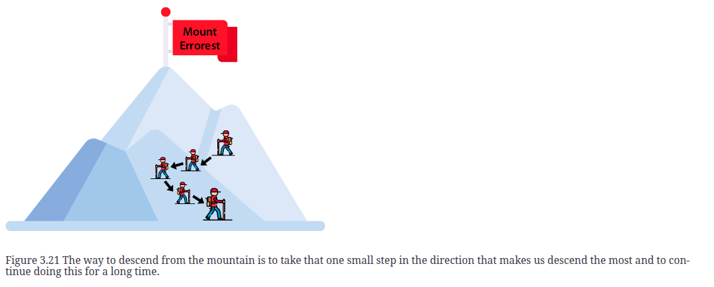
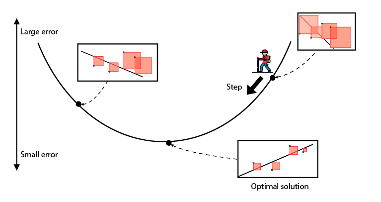

- *How to decrease an error function by slowly descending from a mountain*
- Every time we “move a small amount in this direction,” we are calculating in the background a derivative of the error function and using it to give us a direction in which to move our line.
- **gradient descent** comes in: it is a great way to minimize a (error) (absolute or square) function.
- 
- 