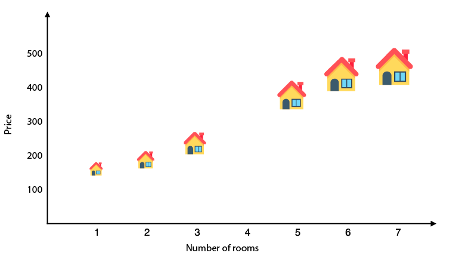
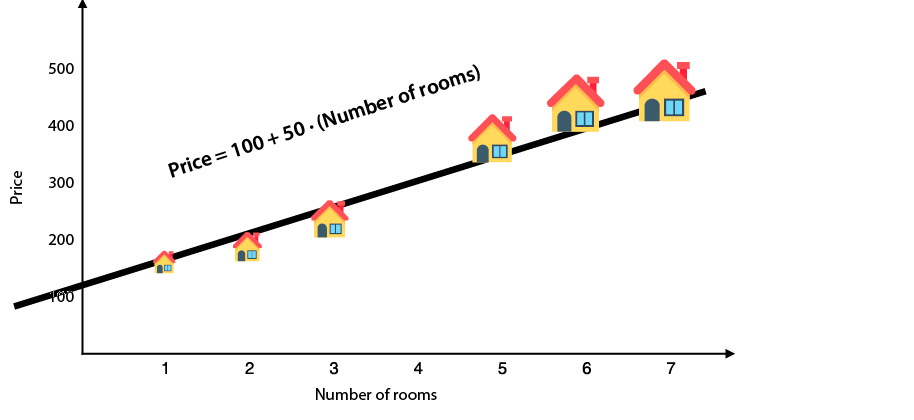
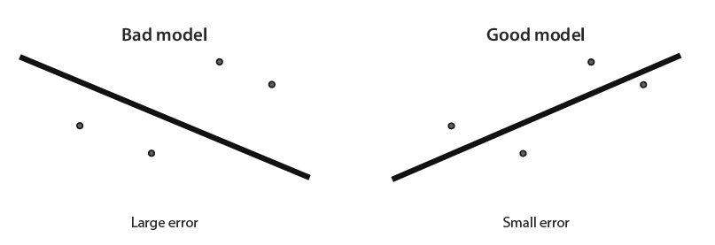

- **Basic example**
  
- ```Price = 100 + 50(Number of rooms)
  Price = 100 + 50(Number of rooms)
  ```
- The price per room is called the *weight* (50) of that corresponding feature, and the base price is called the *bias* (100) of the model
- **features** The features of a data point are those properties that we use to make our prediction #card
  card-last-interval:: 4
  card-repeats:: 1
  card-ease-factor:: 2.6
  card-next-schedule:: 2026-01-05T18:53:30.604Z
  card-last-reviewed:: 2026-01-01T18:53:30.604Z
  card-last-score:: 5
- **labels** This is the target that we try to predict from the features. In this case, the label is the price of the house. #card
  card-last-interval:: 4
  card-repeats:: 1
  card-ease-factor:: 2.6
  card-next-schedule:: 2026-01-05T18:52:59.919Z
  card-last-reviewed:: 2026-01-01T18:52:59.920Z
  card-last-score:: 5
- **model** A machine learning model is a rule, or a formula, which predicts a label from the features #card
  card-last-interval:: 4
  card-repeats:: 1
  card-ease-factor:: 2.6
  card-next-schedule:: 2026-01-05T18:52:53.737Z
  card-last-reviewed:: 2026-01-01T18:52:53.737Z
  card-last-score:: 5
- **prediction** The prediction is the output of the model. If the model says, “I think the house with four rooms is going to cost $300,” then the prediction is 300. #card
  card-last-interval:: 4
  card-repeats:: 1
  card-ease-factor:: 2.6
  card-next-schedule:: 2026-01-05T18:53:49.871Z
  card-last-reviewed:: 2026-01-01T18:53:49.872Z
  card-last-score:: 5
- **weights** In the formula corresponding to the model, each feature is multiplied by a corresponding factor. These factors are the weights. In the previous formula, the only feature is the number of rooms, and its corresponding weight is 50. #card
  card-last-interval:: 4
  card-repeats:: 1
  card-ease-factor:: 2.6
  card-next-schedule:: 2026-01-05T18:54:17.949Z
  card-last-reviewed:: 2026-01-01T18:54:17.951Z
  card-last-score:: 5
- **bias** As you can see, the formula corresponding to the model has a constant that is not attached to any of the features. This constant is called the bias. In this model, the bias is 100, and it corresponds to the base price of a house. #card
  card-last-interval:: 4
  card-repeats:: 1
  card-ease-factor:: 2.6
  card-next-schedule:: 2026-01-05T18:54:26.090Z
  card-last-reviewed:: 2026-01-01T18:54:26.090Z
  card-last-score:: 5
- **Complicated example**
  
- 
- ```
  Price = 100 + 50(Number of rooms) + (Small error)
  ```
- **slope** The slope of a line is a measure of how steep it is. This ratio is constant over the whole line. In a machine learning model, this is the weight of the corresponding feature#card
  card-last-interval:: 4
  card-repeats:: 1
  card-ease-factor:: 2.6
  card-next-schedule:: 2026-01-05T18:55:30.797Z
  card-last-reviewed:: 2026-01-01T18:55:30.797Z
  card-last-score:: 5
- ***y*-intercept** The *y*-intercept of a line is the height at which the line crosses the vertical (*y-*) axis. In a machine learning model, it is the bias and tells us what the label would be in a data point where all the features are precisely zero. #card
  card-last-interval:: -1
  card-repeats:: 1
  card-ease-factor:: 2.5
  card-next-schedule:: 2026-01-01T19:00:00.000Z
  card-last-reviewed:: 2026-01-01T18:55:37.378Z
  card-last-score:: 1
- **linear equation** This is the equation of a line. It is given by two parameters: the slope and the *y*-intercept. If the slope is *m* and the *y*-intercept is *b*, then the equation of the line is *y* = *mx* + *b*, and the line is formed by all the points (*x,y*) that satisfy the equation #card
  card-last-interval:: 4
  card-repeats:: 1
  card-ease-factor:: 2.6
  card-next-schedule:: 2026-01-05T18:55:10.183Z
  card-last-reviewed:: 2026-01-01T18:55:10.183Z
  card-last-score:: 5
- 
- **Multivariate linear regression** models the linear relationship between **multiple independent variables (predictors)** and **one or more dependent (outcome) variables** #card
  card-last-interval:: 4
  card-repeats:: 1
  card-ease-factor:: 2.6
  card-next-schedule:: 2026-01-05T18:55:44.999Z
  card-last-reviewed:: 2026-01-01T18:55:45.000Z
  card-last-score:: 5
- ```
  Price = 30(number of rooms) + 1.5(size) + 10(quality of the schools) – 2(age of the house) + 50
  ```
-
-
- ## How to get the computer to draw this line: The linear regression algorithm
  
  The way we do this is the same way we do many things in machine learning: step by step. Start with a random line, and figure out a way to improve this line a *little bit* by moving it closer to the points. Repeat this process many times, and voilà, we have the desired line. This process is called the linear regression algorithm.
- 
- **learning rate** A very small number that we pick before training our model. This number helps us make sure our model changes in very small amounts by training #card
  card-last-interval:: 4
  card-repeats:: 1
  card-ease-factor:: 2.6
  card-next-schedule:: 2026-01-05T18:51:59.224Z
  card-last-reviewed:: 2026-01-01T18:51:59.224Z
  card-last-score:: 5
- **Error function** (Also called *loss functions* or *cost functions*) is a metric that tells us how our model is doing #card 
  card-last-interval:: 4
  card-repeats:: 1
  card-ease-factor:: 2.6
  card-next-schedule:: 2026-01-05T18:51:22.161Z
  card-last-reviewed:: 2026-01-01T18:51:22.162Z
  card-last-score:: 5
  
  **Types:**
  [[absolute error]]
  [[square error]]
- [[Gradient Descent]] *How to decrease an error function by slowly descending from a mountain*
-
- ### Problems
- [[Underfitting]]
- [[Overfitting]]
- Setting the right hyperparameters for our model is of extreme importance. If we set some of them wrong, we are prone to underfit or overfit #card
  card-last-interval:: 4
  card-repeats:: 1
  card-ease-factor:: 2.6
  card-next-schedule:: 2026-01-05T18:51:51.606Z
  card-last-reviewed:: 2026-01-01T18:51:51.606Z
  card-last-score:: 5
- ### Solutions to Avoid Underfitting and Overfitting
- testing and validation
- model complexity graph
- regularization