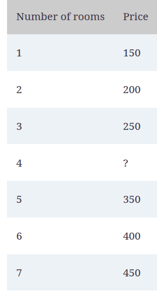

- **Basic example**
  
- ```Price = 100 + 50(Number of rooms)
  Price = 100 + 50(Number of rooms)
  ```
- The price per room is called the *weight* (50) of that corresponding feature, and the base price is called the *bias* (100) of the model
- **features** The features of a data point are those properties that we use to make our prediction #card
- **labels** This is the target that we try to predict from the features. In this case, the label is the price of the house. #card
- **model** A machine learning model is a rule, or a formula, which predicts a label from the features #card
- **prediction** The prediction is the output of the model. If the model says, “I think the house with four rooms is going to cost $300,” then the prediction is 300. #card
- **weights** In the formula corresponding to the model, each feature is multiplied by a corresponding factor. These factors are the weights. In the previous formula, the only feature is the number of rooms, and its corresponding weight is 50. #card
- **bias** As you can see, the formula corresponding to the model has a constant that is not attached to any of the features. This constant is called the bias. In this model, the bias is 100, and it corresponds to the base price of a house. #card
- **Complicated example**
  
-