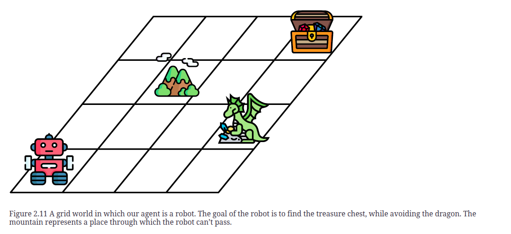

- **Reinforcement learning** is a different type of machine learning in which no data is given, and we must get the computer to perform a task. #card
  card-last-interval:: -1
  card-repeats:: 1
  card-ease-factor:: 2.5
  card-next-schedule:: 2026-01-01T19:00:00.000Z
  card-last-reviewed:: 2026-01-01T18:52:29.124Z
  card-last-score:: 1
- 
-