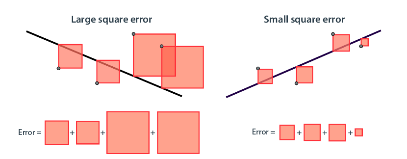

- sum of the squares of these distances #card
- 
- the square error is used more commonly in practice than the absolute error. Why? A square has a much nicer derivative than an absolute value, which comes in handy during the training process.
- the **mean square error** is the average of the squares of these same distances #card
- **root mean square error**. It is used to match the units in the problem and also to give us a better idea of how much error the model makes in a prediction. How so? Imagine the following scenario: if we are trying to predict house prices, then the units of the price and the predicted price are, for example, dollars ($). The units of the square error and the mean square error are dollars squared, which is not a common unit. If we take the square root, then not only do we get the correct unit, but we also get a more accurate idea of roughly by how many dollars the model is off per house. #card