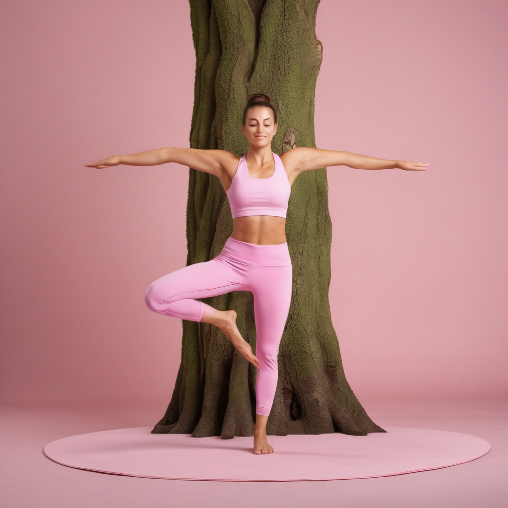

- Following code generates three images of yoga pose
- ```
  # ai_yoga_video_hf_tts.py
  import torch
  from diffusers import StableDiffusionPipeline
  from PIL import Image
  from transformers import pipeline
  from moviepy import ImageSequenceClip, AudioFileClip, VideoFileClip
  import os
  
  # -------------------------------
  # Configuration
  # -------------------------------
  output_dir = "output"
  frames_dir = os.path.join(output_dir, "frames")
  os.makedirs(frames_dir, exist_ok=True)
  
  device = "cuda" if torch.cuda.is_available() else "cpu"
  
  # User inputs
  character = "female yoga instructor, wearing pink outfit"
  pose_list = [
      "downward dog pose, studio background",
      "warrior II pose, studio background",
      "tree pose, studio background"
  ]
  instructions = [
      "Let's start with a gentle downward dog. Keep your back straight and breathe deeply.",
      "Now move to warrior two pose, arms stretched out, feel your legs strong.",
      "Finally, tree pose. Balance on one leg and keep your core tight."
  ]
  
  # -------------------------------
  # Step 1: Initialize Stable Diffusion
  # -------------------------------
  print("Loading Stable Diffusion model...")
  pipe = StableDiffusionPipeline.from_pretrained(
      "stabilityai/stable-diffusion-xl-base-1.0",
      torch_dtype=torch.float16 if device=="cuda" else torch.float32
  )
  pipe = pipe.to(device)
  
  # -------------------------------
  # Step 2: Generate frames for each pose
  # -------------------------------
  frame_paths = []
  for i, pose in enumerate(pose_list):
      prompt = f"{character}, {pose}, realistic, high quality, full body"
      print(f"Generating frame {i+1} for prompt: {prompt}")
      image = pipe(prompt, num_inference_steps=25).images[0]
      frame_path = os.path.join(frames_dir, f"frame_{i+1}.png")
      image.save(frame_path)
      frame_paths.append(frame_path)
  
  # -------------------------------
  # Step 3: Create video from frames
  # -------------------------------
  print("Creating video from frames...")
  clip = ImageSequenceClip(frame_paths, fps=1)  # 1 frame per second for demonstration
  video_path = os.path.join(output_dir, "yoga_video.mp4")
  clip.write_videofile(video_path)
  
  # -------------------------------
  # Step 4: Generate TTS audio using Hugging Face pipeline
  # -------------------------------
  print("Generating audio instructions using Hugging Face TTS...")
  tts_model = "espnet/kan-bayashi_ljspeech_vits"
  tts_pipeline = pipeline("text-to-speech", model=tts_model, device=0 if device=="cuda" else -1)
  
  full_text = " ".join(instructions)
  audio_path = os.path.join(output_dir, "instructions.wav")
  
  # Save audio
  speech_array, sampling_rate = tts_pipeline(full_text)["array"], tts_pipeline(full_text)["sampling_rate"]
  from scipy.io.wavfile import write
  write(audio_path, sampling_rate, speech_array)
  
  # -------------------------------
  # Step 5: Merge video and audio
  # -------------------------------
  print("Merging video and audio...")
  video_clip = VideoFileClip(video_path)
  audio_clip = AudioFileClip(audio_path)
  final_clip = video_clip.set_audio(audio_clip)
  final_path = os.path.join(output_dir, "final_yoga_video.mp4")
  final_clip.write_videofile(final_path)
  
  print(f"Finished! Final video saved at: {final_path}")
  ```
- 